Week4 - Spatial ggplot2
================

### Quick tutorial - Multi Plot with ggplot2

Multiple Plots in one window is possible with ggplot2 but is done with a different method. Remember how we named different ggplot2 instances in the previous tutorial? We must do that again in order to achieve the results we want.

``` r
library(ggplot2)
library(grid)
library(gridExtra)

acadia = read.csv("/Users/james/Downloads/acadia.csv")

p1 = ggplot(acadia, aes(x=year, y=visitors)) +
    geom_line(col="yellow", size=5) + 
    geom_point(col="steelblue", size=3) + 
    geom_smooth(method="lm", col="firebrick") +
    labs(title="Acadia National Park Attendance", subtitle="Total Visitors per year", y="Visitors", x="Year", caption="National Park Database")

p2 = ggplot(acadia, aes(x=year, y=visitors)) +
    geom_line(col="green", size=5) + 
    geom_point(col="black", size=3) + 
    geom_smooth(method="lm", col="orange") +
    labs(title="Acadia National Park Attendance", subtitle="Total Visitors per year", y="Visitors", x="Year", caption="National Park Database")

grid.arrange(p1,p2, ncol=1, nrow=2)
```

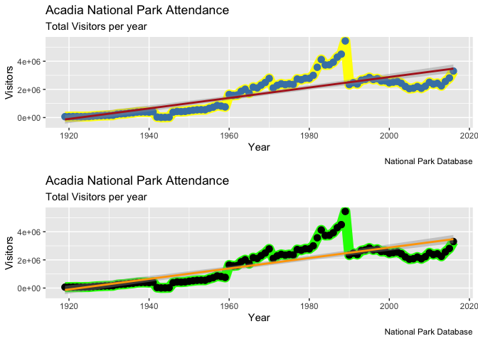

We give our 2 plots (or however many plots we have) and tell `grid.arrange()` how many rows and columns we want. Let's say we wanted to show the plots this way...

``` r
library(ggplot2)
library(grid)
library(gridExtra)

acadia = read.csv("/Users/james/Downloads/acadia.csv")

p1 = ggplot(acadia, aes(x=year, y=visitors)) +
    geom_line(col="yellow", size=5) + 
    geom_point(col="steelblue", size=3) + 
    geom_smooth(method="lm", col="firebrick") +
    labs(title="Acadia National Park Attendance", subtitle="Total Visitors per year", y="Visitors", x="Year", caption="National Park Database")

p2 = ggplot(acadia, aes(x=year, y=visitors)) +
    geom_line(col="green", size=5) + 
    geom_point(col="black", size=3) + 
    geom_smooth(method="lm", col="orange") +
    labs(title="Acadia National Park Attendance", subtitle="Total Visitors per year", y="Visitors", x="Year", caption="National Park Database")

grid.arrange(p1,p2, ncol=1, nrow=3)
```

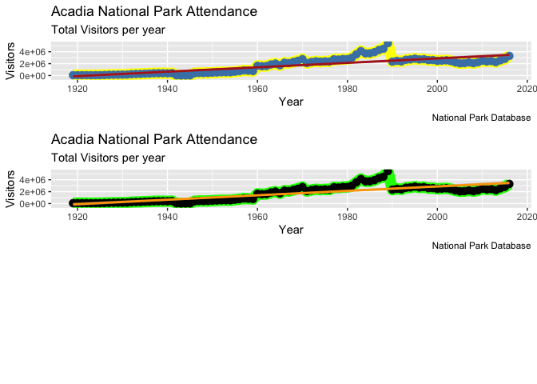

Notice how it left the 3rd row empty because we only provided 2 plots (p1 and p2).

ggplot2 and Spatial Data
========================

#### Recap with base graphics

When it comes to spatial data, the `raster` package is our go-to library. Here's how we imported and plotted rasters using base graphics.

``` r
library(maptools) # also loads sp package
```

    ## Loading required package: sp

    ## Checking rgeos availability: TRUE

``` r
library(raster)
library(rasterVis)
```

    ## Loading required package: lattice

    ## Loading required package: latticeExtra

    ## 
    ## Attaching package: 'latticeExtra'

    ## The following object is masked from 'package:ggplot2':
    ## 
    ##     layer

``` r
library(RColorBrewer)
sstRast <- raster("/Users/james/Documents/Github/geog473-673/datasets/GOES_R_ROLLING_1DAY_20190814.nc")
```

    ## Loading required namespace: ncdf4

``` r
# crop the raster so this runs faster
sstRast <- crop(sstRast, extent(-100,-80,16,30))
sstRast
```

    ## class      : RasterLayer 
    ## dimensions : 774, 1111, 859914  (nrow, ncol, ncell)
    ## resolution : 0.018, 0.0181  (x, y)
    ## extent     : -99.99915, -80.00115, 15.99378, 30.00318  (xmin, xmax, ymin, ymax)
    ## crs        : +proj=longlat +datum=WGS84 +ellps=WGS84 +towgs84=0,0,0 
    ## source     : memory
    ## names      : Sea.Surface.Temperature 
    ## values     : 25.86023, 34.9397  (min, max)
    ## time       : 1565800243

``` r
image(sstRast)
```

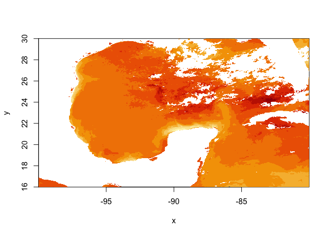

``` r
# levelplot the sstRast
# USA shapefiles via the getData function
usa <- getData('GADM', country = 'USA', level = 1)

# Throw together the usa spatial polygons data frame
plt <- levelplot(sstRast, margin=F, par.settings=BuRdTheme,
       main="GOES-R Rolling SST 08/14")
plt + layer(sp.polygons(usa, col='black',fill='grey', lwd=0.4))
```

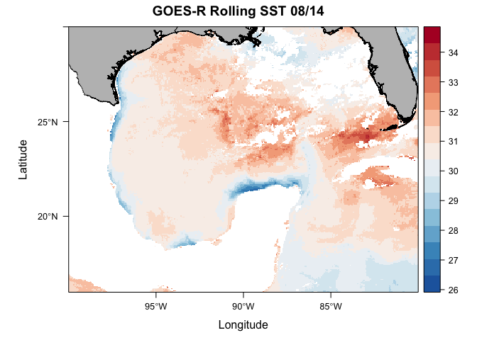

Let's do this same thing with ggplot2. We'll need the help of a package called `mapproj` to make sense of some external maps `ggplot2` uses - note that we need to convert sstRast into a dataframe for `ggplot2`

``` r
library(ggplot2)
library(mapproj)
```

    ## Loading required package: maps

``` r
# convert to dataframe
df <- as.data.frame(sstRast, xy = TRUE) 
ggplot() +
  geom_raster(data = df , aes(x = x, y = y, fill = Sea.Surface.Temperature)) + 
  coord_quickmap()
```

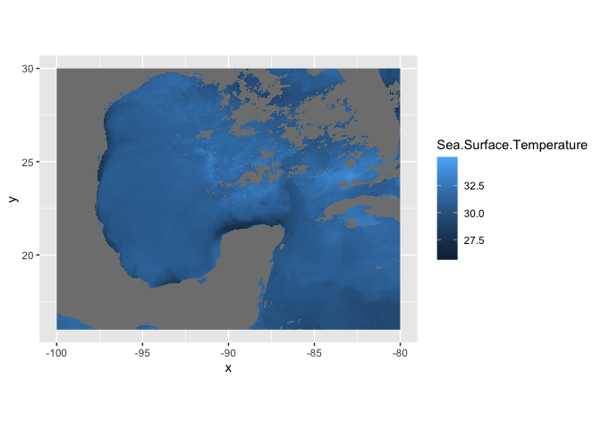

``` r
# look into coord_quickmap
```

The main new function here is `coord_quickmap()`. It gives the x/y values a geospatial domain. Here's what it looks like:

`coord_quickmap(xlim = NULL, ylim = NULL, expand = TRUE,   clip = "on")`

It's derived from `coord_map` which looks like this:

`coord_map(projection = "mercator", ..., parameters = NULL,   orientation = NULL, xlim = NULL, ylim = NULL, clip = "on")`

``` r
# now let's use a better colorscheme
jet.colors <- colorRampPalette(c("#00007F", "blue", "#007FFF", "cyan", "#7FFF7F", "yellow", "#FF7F00", "red", "#7F0000"))
ggplot() +
  geom_raster(data = df , aes(x = x, y = y, fill = Sea.Surface.Temperature)) + 
  scale_fill_gradientn(colors = jet.colors(7), limits = c(28, 33)) + 
  coord_quickmap()
```

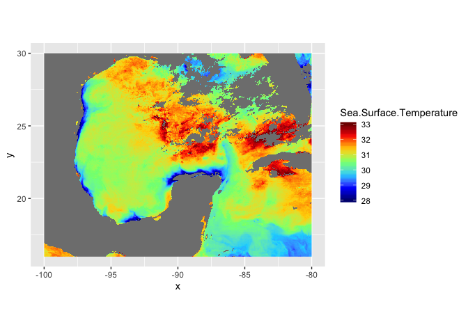

``` r
# now let's add borders
ggplot() +
  geom_raster(data = df , aes(x = x, y = y, fill = Sea.Surface.Temperature)) + 
  scale_fill_gradientn(colors = jet.colors(7), limits = c(28, 33)) + 
  borders(fill="white", xlim = c(-100,-80), ylim=c(16,30),alpha = 0.5) +
  coord_quickmap(xlim = c(-100,-80), ylim=c(16,30))
```

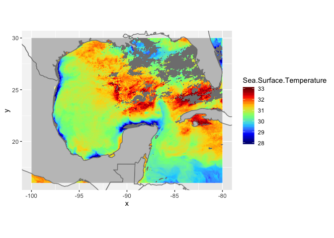

Notice in the final map how I set xlimits and ylimits in the `coord_quickmap` function. This is the same as we did before with `ggplot2` and `coord_cartesian`. Now that we have lat/lon coordinates, we need to specifiy that "zoom in" boundary with `coord_quickmap`.

Let's get rid of the expanded area beyond the raster domain using the `expand=FALSE` argument in `coord_quickmap()`

``` r
ggplot() +
  geom_raster(data = df , aes(x = x, y = y, fill = Sea.Surface.Temperature)) + 
  scale_fill_gradientn(colors = jet.colors(7), limits = c(28, 33)) + 
  borders(fill="white", xlim = c(-100,-80), ylim=c(16,30),alpha = 0.5) +
  coord_quickmap(xlim = c(-100,-80), ylim=c(16,30),expand = FALSE)
```

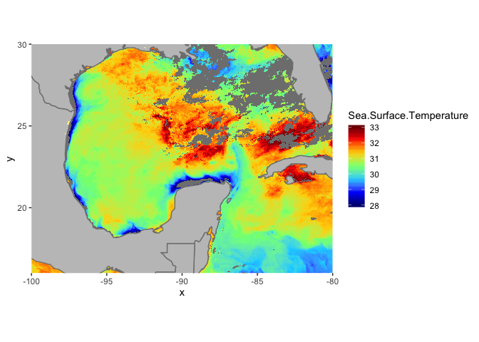

What are some other colors we could use?

``` r
library(RColorBrewer)
display.brewer.all()
```

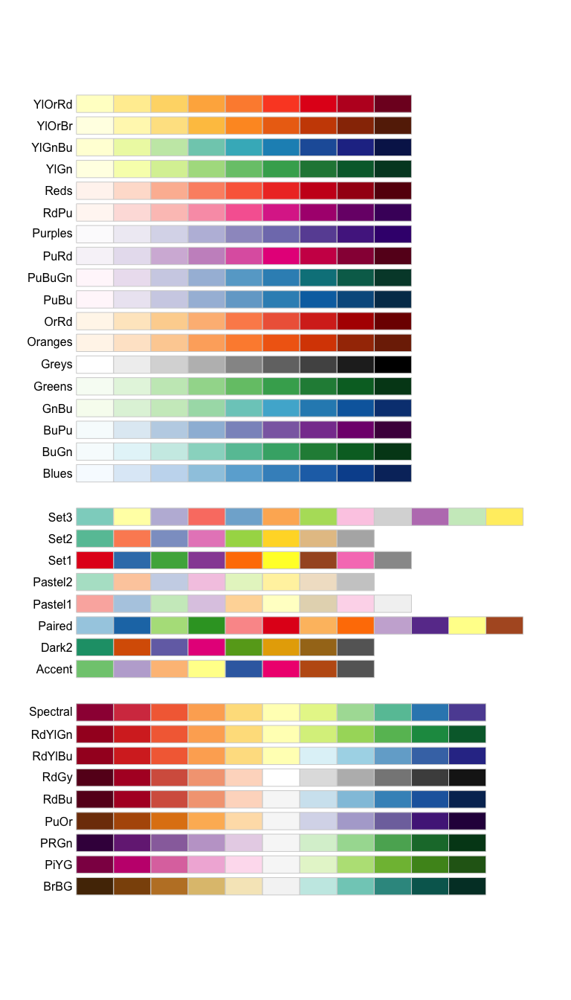

Let's plot using new colors and a white NA value

``` r
cols <- brewer.pal(9, "YlOrRd")# nmaximum for palette YlOrRd is 9
pal <- colorRampPalette(cols)

ggplot() +
  geom_raster(data = df , aes(x = x, y = y, fill = Sea.Surface.Temperature)) + 
  scale_fill_gradientn(colors = pal(20), limits = c(25, 35),na.value = "white") + 
  borders(fill="white", xlim = c(-100,-80), ylim=c(16,30),alpha = 0.5) +
  coord_quickmap(xlim = c(-100,-80), ylim=c(16,30),expand = FALSE)    
```

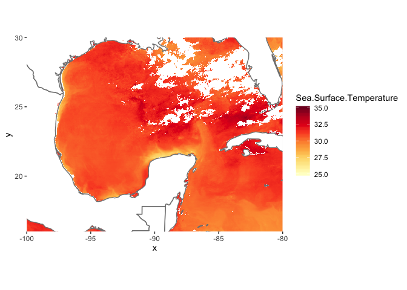

Assignment:
===========

1.  Download treecov.nc from the datasets folder

2.  Plot tree cover variable using ggplot2 and with green colortheme for both South America and Africa. Add coastlines.

3.  Place each ggplot next to each other in one plot window.

4.  Submit resulting image to Canvas assignment 4

Your final product should look something like...

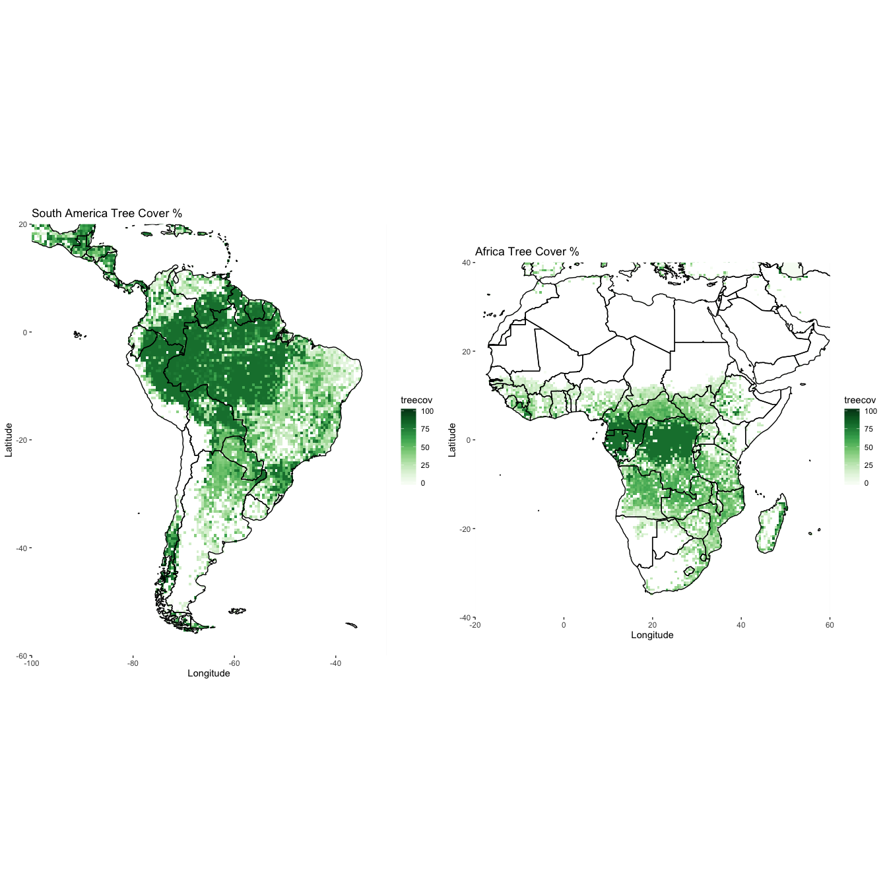
