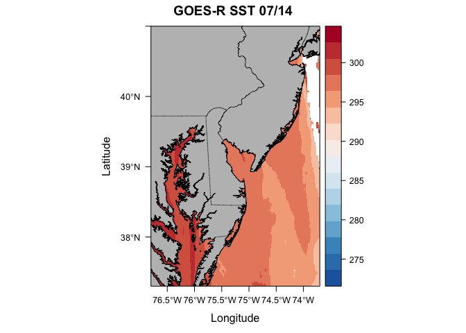
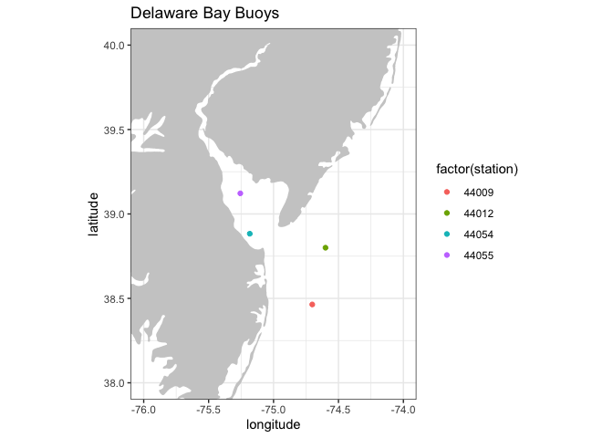
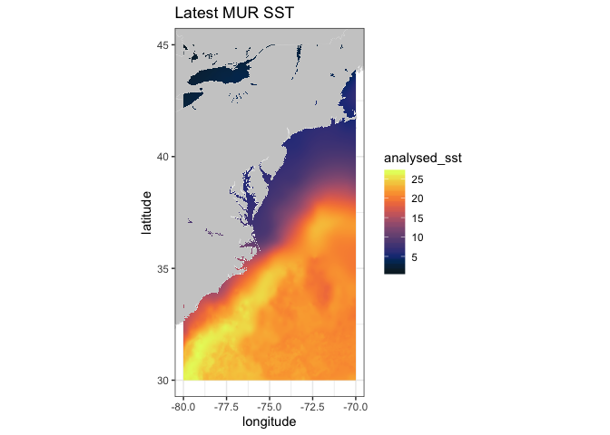
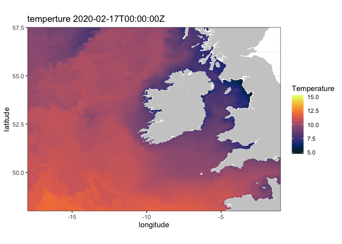

Week 6 - Data Extraction
================

THREDDS and ERDDAP
==================

So far this semester, we've only been playing with datasets that I have stored for you in the datasets folder. I showed you a quick way to download datasets from the folder using R -

`download.file("https://github.com/jsimkins2/geog473-673/tree/master/datasets/TreeData.csv", destfile = "/Users/james/Downloads/TreeData.csv" , mode='wb')`

This is a really useful thing to have to download complete files from a datasets folder on Github. However, while Github is excellent for code, it's not a cloud service for datasets. THREDDS and ERDDAP are the future of environmental data repositories.

### THREDDS

THREDDS (Thematic Realtime Environmental Distributed Data Services) is an efficient way to extract specific areas or time periods of a dataset. For example, if you're studying 2000-2020 water temperatures of the Delaware Bay, you don't necessarily want a water temperature dataset covering the Atlantic Ocean from 1960-2020. It's a waste of time to have to download, store, and process all of that data just to sub-select the Delaware Bay from 2000-2020. THREDDS makes it possible to download your desired subset from the get-go, saving you time and hard-drive space.

Here are some NASA/NOAA/UDEL THREDDS servers I frequently use:

1.  <https://thredds.jpl.nasa.gov/thredds/catalog.html> - NASA Jet Propulsion Labratory
2.  <https://thredds.daac.ornl.gov/thredds/catalog.html> - Oak Ridge National Lab
3.  <https://pae-paha.pacioos.hawaii.edu/thredds/catalog.html> - Pacific Islands Ocean Observing System
4.  <http://thredds.demac.udel.edu/thredds/catalog.html> - UDEL DEMAC
5.  <http://basin.ceoe.udel.edu/thredds/catalog.html> - UDEL Satellite Receiving Station
6.  <http://www.smast.umassd.edu:8080/thredds/catalog.html> - UMASS Thredds

If you have a dataset or type of data you're interested in, google search it with **thredds** or **thredds server** after it.

Today we'll use UDEL's Satellite Receiving Station THREDDS (\#5 on the list). It's located at this URL - <http://basin.ceoe.udel.edu/thredds/catalog.html>

.Here's what that looks like:

    ## PhantomJS not found. You can install it with webshot::install_phantomjs(). If it is installed, please make sure the phantomjs executable can be found via the PATH variable.

<iframe src="https://github.com/jsimkins2/geog473-673/tree/master/documents/images/basin_thredds.png" width="100%" height="400px">
</iframe>
If we click on `GOES-R SST`, we see we have some different avenues for data extraction. <iframe src="https://github.com/jsimkins2/geog473-673/tree/master/documents/images/basin_goesSST.png" width="100%" height="400px"></iframe>

OPeNDAP (Open-source Project for a Network Data Access Protocol) is a great way to subselect the data. Opendap offers html files of the data (BAD IDEA, THIS WILL CRASH YOUR BROWSER) or netCDF files of the data (great idea)

<iframe src="https://github.com/jsimkins2/geog473-673/tree/master/documents/images/basin_opendap.png" width="100%" height="400px">
</iframe>
Now you can use this page to download subset datasets, or we can make this really easy and use R to accomplish that task. This is a high temporal resolution dataset, so let's say we want Delaware Bay data from July 14 - July 16, 2019. All we need to make this happen is the url of the opendap page - <http://basin.ceoe.udel.edu/thredds/dodsC/goes_r_sst.nc.html> - and the `ncdf4` package.

``` r
library(ncdf4)
goes.nc = nc_open("http://basin.ceoe.udel.edu/thredds/dodsC/goes_r_sst.nc")
goes.nc
```

    ## File http://basin.ceoe.udel.edu/thredds/dodsC/goes_r_sst.nc (NC_FORMAT_CLASSIC):
    ## 
    ##      4 variables (excluding dimension variables):
    ##         float projection[]   
    ##             proj4_string: +proj=longlat +datum=WGS84 +ellps=WGS84 +towgs84=0,0,0
    ##             epsg_code: 4326
    ##         float Band15[longitude,latitude,time]   
    ##             long_name: GOES-16 Band 15 Brightness Temperature
    ##             standard_name: brightness_temperature
    ##             units: kelvin
    ##             valid_min: 0
    ##             valid_max: 4095
    ##             _ChunkSizes: 1
    ##              _ChunkSizes: 1989
    ##              _ChunkSizes: 2778
    ##         float DQF[longitude,latitude,time]   
    ##             long_name: ABI L2+ Sea Surface (Skin) Temperature data quality flags
    ##             standard_name: status_flag
    ##             units: 1
    ##             flag_values: 0
    ##              flag_values: 1
    ##              flag_values: 2
    ##              flag_values: 3
    ##             flag_meanings: good_quality_qf degraded_quality_qf severely_degraded_quality_qf invalid_due_to_unprocessed_qf
    ##             _ChunkSizes: 1
    ##              _ChunkSizes: 1989
    ##              _ChunkSizes: 2778
    ##         float SST[longitude,latitude,time]   
    ##             long_name: ABI L2+ Sea Surface (Skin) Temperature
    ##             standard_name: sea_surface_skin_temperature
    ##             units: K
    ##             resolution: y: 0.000056 rad x: 0.000056 rad
    ##             missing_value: -999
    ##             _ChunkSizes: 1
    ##              _ChunkSizes: 1989
    ##              _ChunkSizes: 2778
    ## 
    ##      3 dimensions:
    ##         latitude  Size:1989
    ##             standard_name: latitude
    ##             units: degrees_north
    ##             _ChunkSizes: 1989
    ##         longitude  Size:2778
    ##             standard_name: longitude
    ##             units: degrees_east
    ##             _ChunkSizes: 2778
    ##         time  Size:10451
    ##             standard_name: time
    ##             long_name: EPOCH Time
    ##             units: seconds since 1970-01-01T00:00:00Z
    ##             _ChunkSizes: 1
    ## 
    ##     15 global attributes:
    ##         _NCProperties: version=1|netcdflibversion=4.6.1|hdf5libversion=1.10.2
    ##         creator_name: James Simkins
    ##         creator_email: simkins@udel.edu
    ##         institution: University of Delaware Ocean Exploration, Remote Sensing and Biogeography Group (ORB)
    ##         url: http://orb.ceoe.udel.edu/
    ##         source: satellite observation NASA MODIS-Aqua instrument
    ##         groundstation: University of Delaware, Newark, Center for Remote Sensing
    ##         software: 0
    ##         inputMET1: 0
    ##         inputOZONE1: 0
    ##         inputCalibrationFile: 0
    ##         product_list: SST, DQF
    ##         summary: GOES16 SST product, reprojected to EPSG:4326.
    ##         history: Fri Feb 14 11:19:49 2020: ncks /data/GOES/GOES-R/sst/2020/OR_ABI-L2-SSTF-M3_G16_s20200451500021_e20200451559329_c20200451605577.nc /data/GOES/GOES-R/sst/2020/OR_ABI-L2-SSTF-M3_G16_s20200451500021_e20200451559329_c20200451605577.nc -L 5 -O
    ##         NCO: netCDF Operators version 4.7.5 (Homepage = http://nco.sf.net, Code = http://github.com/nco/nco)

Just with that one line of code, we've opened a connection with the GOES-R dataset on the THREDDS server. Printing the netcdf dataset provides some metadata info. Let's use this metadata and extract the time period / spatial extent that we want.

``` r
# print out the names of the variables in our dataset
names(goes.nc$var)
```

    ## [1] "projection" "Band15"     "DQF"        "SST"

``` r
# how is the time stored?
goes.nc$dim$time$units
```

    ## [1] "seconds since 1970-01-01T00:00:00Z"

Seconds since 1970-01-01 is referred to as **EPOCH time**. Basically, this datetime is considered the inception of the internet. Computers are very good at storing information in this format and this is why we use this. Let's take out the last value -

``` r
lastVal = length(goes.nc$dim$time$vals)
lastVal
```

    ## [1] 10451

``` r
epoch_val = goes.nc$dim$time$vals[lastVal]
```

There you go, that's an EPOCH time value. Let's convert it to a human timestamp...

``` r
human_time = as.POSIXct(epoch_val, origin="1970-01-01")
human_time
```

    ## [1] "2020-02-14 11:29:47 EST"

`as.POSIXct` is a datetime package in R. It is a gold standard and you'll see it as you gain more experience in playing with datetime conversions. You can also use `anytime` package.

``` r
library(anytime)
anytime(epoch_val)
```

    ## [1] "2020-02-14 11:29:47 EST"

At this point, all we have to do is convert our human dates to EPOCH so we can extract the data. In order to do this all we need to do is convert a datetime object to a numeric. R handles it for us...

``` r
start_time = "2019-07-14" # year dash month dash day
epoch_start_time = as.numeric(as.POSIXct(start_time, format="%Y-%m-%d")) # %Y-%m-%d is telling the computer the format of our datestring is year dash month dash day

end_time = "2019-07-16" # year dash month dash day
epoch_end_time = as.numeric(as.POSIXct(end_time, format="%Y-%m-%d")) # %Y-%m-%d is telling the computer the format of our datestring is year dash month dash day
```

We have the time values converted to the format of the dataset, but now we need to find the index - i.e. where that value lies in the dataset. We can find this using this code...

`which.min(abs(array - value))`

Which reads as -

-   `which.min()` - which value is the minimum of this array
-   `abs()` - absolute value - we take the absolute value because negative numbers confuse the math

``` r
index_start_time = which.min(abs(goes.nc$dim$time$vals - epoch_start_time))
index_start_time
```

    ## [1] 5624

That's the index! This is just a big matching game essentially.

``` r
goes.nc$dim$time$vals[index_start_time]
```

    ## [1] 1563075022

``` r
epoch_start_time
```

    ## [1] 1563076800

Alright, we have our start time index ! Now what about the latitude / longitudes? We'll need to find the index of the lat/lon grid we want. Delaware bay is approximately between -75.8 W, -74.7 W, 38.3 N, and 40 N.

``` r
# print out a few longitude values - notice that the entire dataset is on this grid right here. 
head(goes.nc$dim$lon$vals)
```

    ## [1] -99.99015 -99.97215 -99.95415 -99.93615 -99.91814 -99.90015

``` r
# notice how we extract those values using indexing - the 100th value 
goes.nc$dim$lon$vals[100]
```

    ## [1] -98.20815

The 100th lon value is -98.20815. Aka, a lon index of 100 returns -98.20815.

So...which value is the minimum of the absolute value of the array of values minus the specific value? Let's plug it in...

``` r
west_lon = -76.8
index_west_lon = which.min(abs(goes.nc$dim$longitude$vals - west_lon))
index_west_lon
```

    ## [1] 1289

``` r
goes.nc$dim$longitude$vals[index_west_lon]
```

    ## [1] -76.80614

So our desired `west_lon` is `-75.8`, and the closest value within our longitude array is `-75.79815`. Not bad...let's run the rest.

``` r
east_lon = -73.7
index_east_lon = which.min(abs(goes.nc$dim$longitude$vals - east_lon))

north_lat = 41
index_north_lat = which.min(abs(goes.nc$dim$latitude$vals - north_lat))
south_lat = 37.3
index_south_lat = which.min(abs(goes.nc$dim$latitude$vals - south_lat))
```

Everything is indexed! Now we can use these indexes to extract the exact data that we want via `ncvar_get` from the `ncdf4` package. We can enter in arguments named `start` and `count`. This tells `ncvar_get` at what space / time to **start** grabbing values. `count` tells `ncvar_get` how long to `count` in space / time. For example, if the resolution of our data is hourly and we start at `12:00:00` and the count is `4`, that means we grab data at `12:00:00 , 13:00:00 , 14:00:00 , 15:00:00 , 16:00:00`. The same goes for `lat` and `lon` - the count all depends on **what resolution your data is in**. If you have a spatial dataset at 5 degree resolution, each count will bring in another 5 degree lat/lon value.

At this point, we know our `start` values. At this point, we only have end values, not count values...Let's figure those out

``` r
time_count = which.min(abs(goes.nc$dim$time$vals - epoch_end_time)) - which.min(abs(goes.nc$dim$time$vals - epoch_start_time))
time_count
```

    ## [1] 48

So, if we count `48` time values from the start\_time of `2019-07-14`, we'll arrive at the end\_time of `2019-07-16`. Let's do the same for our lat/lons.

``` r
# latitude counts
lat_count = abs(index_north_lat - index_south_lat)
lon_count = abs(index_west_lon - index_east_lon)
```

Why do we take the absolute value? Because sometimes data is stored backwards. We don't care which way it's stored, we just need a positive number to count up from the starting value. Longitude values are weird because many times they are stored as negative values if they're west of the meridian. Latitude values are also negative if we go south of the equator.

Now we have our count values, we can proceed. Remember, here is what the `start` argument is looking for...via (`?ncvar_get`)

`A vector of indices indicating where to start reading the passed values (beginning at 1). The length of this vector must equal the number of dimensions the variable has. Order is X-Y-Z-T (i.e., the time dimension is last). If not specified, reading starts at the beginning of the file (1,1,1,...).`

So x is longitude, y is latitude, and t is time. Whichever value is lower between `index_west_lon` and `index_east_lon` is our `start` value, and vice versa for latitudes.

``` r
index_west_lon
```

    ## [1] 1289

``` r
index_east_lon
```

    ## [1] 1462

``` r
index_south_lat
```

    ## [1] 1178

``` r
index_north_lat
```

    ## [1] 1382

And here is what the `count` argument is looking for...

`A vector of integers indicating the count of values to read along each dimension (order is X-Y-Z-T). The length of this vector must equal the number of dimensions the variable has. If not specified and the variable does NOT have an unlimited dimension, the entire variable is read. As a special case, the value "-1" indicates that all entries along that dimension should be read.`

We already have our `count` values in place..let's plug them in and run - note this will take a few seconds to run and even longer if you have poor internet connection. This is data being extracted through the internet in real time.

``` r
# cool, let's grab SST (Sea Surface Temperature) for Delaware Bay from January 10th-12th
sst.c <- ncvar_get(goes.nc, "SST",start = c(index_east_lon,index_south_lat,index_start_time), 
                   count = c(lon_count,lat_count,time_count))
dim(sst.c)
```

    ## [1] 173 204  48

And there is the data! It returns the raw data in the format we pulled it in - Lon, Lat, Time. We have a 2 dimensional array (lon x lat) with 48 time slices. Let's convert one to raster and plot it really quickly.

``` r
library(maptools) # also loads sp package
```

    ## Loading required package: sp

    ## Checking rgeos availability: TRUE

``` r
library(ncdf4)
library(raster)
library(rasterVis)
```

    ## Loading required package: lattice

    ## Loading required package: latticeExtra

``` r
arr.sst = sst.c[,,4]
arr.sst[arr.sst < 273] = NA
test.sst = raster(x = arr.sst)
test.sst
```

    ## class      : RasterLayer 
    ## dimensions : 173, 204, 35292  (nrow, ncol, ncell)
    ## resolution : 0.004901961, 0.005780347  (x, y)
    ## extent     : 0, 1, 0, 1  (xmin, xmax, ymin, ymax)
    ## crs        : NA 
    ## source     : memory
    ## names      : layer 
    ## values     : 273.5828, 302.611  (min, max)

What's missing? Well we just gave it the raw data, we still need to plug in the extents! Also, we will need to plug in the CRS - luckily we know this data is in lat/lon because of how awesome this metadata is!

``` r
sst.crs = ncatt_get(goes.nc, "projection")
extent(test.sst) = c(west_lon, east_lon, south_lat, north_lat)
crs(test.sst) = sst.crs$proj4_string
test.sst
```

    ## class      : RasterLayer 
    ## dimensions : 173, 204, 35292  (nrow, ncol, ncell)
    ## resolution : 0.01519608, 0.02138728  (x, y)
    ## extent     : -76.8, -73.7, 37.3, 41  (xmin, xmax, ymin, ymax)
    ## crs        : +proj=longlat +datum=WGS84 +ellps=WGS84 +towgs84=0,0,0 
    ## source     : memory
    ## names      : layer 
    ## values     : 273.5828, 302.611  (min, max)

``` r
# let's use levelplot to get this done
usa <- getData('GADM', country = 'USA', level = 1)

# Throw together the usa spatial polygons data frame
plt <- levelplot(test.sst, margin=F, par.settings=BuRdTheme,
       main="GOES-R SST 07/14")
plt + layer(sp.polygons(usa, col='black',fill='grey', lwd=0.4))
```



Boom...There's the data we wanted and you didn't have to leave R to get it. You also saved a ton of time and hard drive space.

ERDDAP
------

So THREDDS is super fast but it's not the most human-friendly. ERDDAP, on the other hand, is meant for humans. ERDDAP is a data server that gives you a simple, consistent way to download subsets of gridded and tabular scientific datasets in common file formats and make graphs and maps. ERDDAP can generate maps on the fly so you can check out the data before you proceed to download. Here are some NASA / NOAA / UDEL ERDDAP pages I frequently use:

1.  <https://upwell.pfeg.noaa.gov/erddap/index.html> - NOAA Global Earth Observation Over 10,000 datasets available here
2.  <https://coastwatch.pfeg.noaa.gov/erddap/index.html> - NOAA Ocean ERDDAP - over 1400 datasets available here
3.  <https://gliders.ioos.us/erddap/index.html> - IOOS Ocean Glider Data - Over 600 datasets here
4.  <http://www.neracoos.org/erddap/index.html> - NERACOOS Ocean/Met - Over 200 Datasets
5.  <http://basin.ceoe.udel.edu/erddap/index.html> - UDEL Satellite Receiving Station ERDDAP

-   Here's a bigger list - <https://github.com/rmendels/awesome-erddap>

Let's check out the UDEL Satellite Receiving Station ERDDAP page - here's what it looks like

<iframe src="https://github.com/jsimkins2/geog473-673/tree/master/documents/images/basin_erddap.png" width="100%" height="400px">
</iframe>
If we click on `GOES-R SST`, we see we have some different avenues for data extraction. <iframe src="https://github.com/jsimkins2/geog473-673/tree/master/documents/images/erddap_datasets.png" width="100%" height="400px"></iframe>

OPeNDAP (Open-source Project for a Network Data Access Protocol) is a great way to subselect the data. Opendap offers html files of the data (BAD IDEA, THIS WILL CRASH YOUR BROWSER) or netCDF files of the data (great idea)

<iframe src="https://github.com/jsimkins2/geog473-673/tree/master/documents/images/goesSST_erddap.png" width="100%" height="400px">
</iframe>
You can use the Data Access Form at the top of the page to select data and download, or we can streamline this and use R to accomplish this easily. In order to do this, we just need the `rerddap` package.

`install.packages("rerddap")`

`library("rerddap")`

``` r
?rerddap
```

    ## No documentation for 'rerddap' in specified packages and libraries:
    ## you could try '??rerddap'

-   the list of servers `rerddap` knows about - `server()`
-   search an <span style="color:red">ERDDAP</span> server for terms - `ed_search(query, page = NULL, page_size = NULL, which = "griddap", url = eurl(), ...)`
-   get a list of datasets on an <span style="color:red">ERDDAP</span> server - `ed_datasets(which = "tabledap", url = eurl())`
-   obtain information about a dataset - `info(datasetid, url = eurl(), ...)`
-   extract data from a griddap dataset - `griddap(x, ..., fields = "all", stride = 1, fmt = "nc", url = eurl(), store = disk(), read = TRUE, callopts = list())`
-   extract data from a tabledap dataset - `tabledap(x, ..., fields = NULL, distinct = FALSE, orderby = NULL, orderbymax = NULL, orderbymin = NULL, orderbyminmax = NULL, units = NULL, url = eurl(), store = disk(), callopts = list())`

Be careful when using the functions `ed_search()` and `ed_datasets()`. The default <span style="color:red">ERDDAP</span> has over 9,000 datasets, most of which are grids, so that a list of all the gridded datasets can be quite long. A seemly reasonable search:

Finding the Data You Want
-------------------------

The first way to find a dataset is to browse the builtin web page for a particular <span style="color:red">ERDDAP</span> server. A list of some of the public available <span style="color:red">ERDDAP</span> servers can be obtained from the `rerddap` command:

``` r
servers()
#>                                                                                             name
#> 1                                                          Marine Domain Awareness (MDA) - Italy
#> 2                                                                     Marine Institute - Ireland
#> 3                                                       CoastWatch Caribbean/Gulf of Mexico Node
#> 4                                                                     CoastWatch West Coast Node
#> 5                     NOAA IOOS CeNCOOS (Central and Northern California Ocean Observing System)
#> 6  NOAA IOOS NERACOOS (Northeastern Regional Association of Coastal and Ocean Observing Systems)
#> 7                                         NOAA IOOS NGDAC (National Glider Data Assembly Center)
#> 8    NOAA IOOS PacIOOS (Pacific Islands Ocean Observing System) at the University of Hawaii (UH)
#> 9                     NOAA IOOS SECOORA (Southeast Coastal Ocean Observing Regional Association)
#> 10                            NOAA NCEI (National Centers for Environmental Information) / NCDDC
#> 11                                                NOAA OSMC (Observing System Monitoring Center)
#> 12                                                           NOAA UAF (Unified Access Framework)
#> 13                                                                   ONC (Ocean Networks Canada)
#> 14                    UC Davis BML (University of California at Davis, Bodega Marine Laboratory)
#> 15                                                                            R.Tech Engineering
#> 16                                     French Research Institute for the Exploitation of the Sea
#>                                         url
#> 1  https://bluehub.jrc.ec.europa.eu/erddap/
#> 2           http://erddap.marine.ie/erddap/
#> 3       http://cwcgom.aoml.noaa.gov/erddap/
#> 4  https://coastwatch.pfeg.noaa.gov/erddap/
#> 5     http://erddap.axiomalaska.com/erddap/
#> 6           http://www.neracoos.org/erddap/
#> 7       http://data.ioos.us/gliders/erddap/
#> 8       http://oos.soest.hawaii.edu/erddap/
#> 9            http://129.252.139.124/erddap/
#> 10   http://ecowatch.ncddc.noaa.gov/erddap/
#> 11             http://osmc.noaa.gov/erddap/
#> 12     https://upwell.pfeg.noaa.gov/erddap/
#> 13           http://dap.onc.uvic.ca/erddap/
#> 14    http://bmlsc.ucdavis.edu:8080/erddap/
#> 15            http://meteo.rtech.fr/erddap/
#> 16  http://www.ifremer.fr/erddap/index.html
```

The second way to find and obtain the desired data is to use functions in `rerddap`. The basic steps are:

1.  Find the dataset on an <span style="color:red">ERDDAP</span> server (`rerddap::servers()`, `rerddap::ed_search()`, `rerddap::ed_datasets()` ).
2.  Get the needed information about the dataset (`rerddap::info()` )
3.  Think about what you are going to do.
4.  Make the request for the data (`rerddap::griddap()` or `rerddap::tabledap()` ).

`rerddap::tabledap()` - Point datasets, like buoy data or weather station.

Here is an example of this...

``` r
whichBUOYS <- rerddap::ed_search(query = "buoy")
```

NOAA’s National Data Buoy Center (NDBC) collects world-wide data from buoys in the ocean. Let's browse that dataset by entering this into the R console

`rerddap::browse('cwwcNDBCMet')`

That's the ERDDAP site that we're going to pull data from

``` r
library(rerddap)
library(ggplot2)
```

    ## 
    ## Attaching package: 'ggplot2'

    ## The following object is masked from 'package:latticeExtra':
    ## 
    ##     layer

``` r
library(mapdata)
```

    ## Loading required package: maps

``` r
info('cwwcNDBCMet')
```

    ## <ERDDAP info> cwwcNDBCMet 
    ##  Base URL: https://upwell.pfeg.noaa.gov/erddap/ 
    ##  Variables:  
    ##      apd: 
    ##          Range: 0.0, 95.0 
    ##          Units: s 
    ##      atmp: 
    ##          Range: -153.4, 50.0 
    ##          Units: degree_C 
    ##      bar: 
    ##          Range: 800.7, 1198.8 
    ##          Units: hPa 
    ##      dewp: 
    ##          Range: -99.9, 48.7 
    ##          Units: degree_C 
    ##      dpd: 
    ##          Range: 0.0, 64.0 
    ##          Units: s 
    ##      gst: 
    ##          Range: 0.0, 75.5 
    ##          Units: m s-1 
    ##      latitude: 
    ##          Range: -55.0, 71.758 
    ##          Units: degrees_north 
    ##      longitude: 
    ##          Range: -177.75, 179.001 
    ##          Units: degrees_east 
    ##      mwd: 
    ##          Range: 0, 359 
    ##          Units: degrees_true 
    ##      ptdy: 
    ##          Range: -15.0, 14.9 
    ##          Units: hPa 
    ##      station: 
    ##      tide: 
    ##          Range: -9.37, 6.13 
    ##          Units: m 
    ##      time: 
    ##          Range: 4910400.0, 1.5816969E9 
    ##          Units: seconds since 1970-01-01T00:00:00Z 
    ##      vis: 
    ##          Range: 0.0, 58.1 
    ##          Units: km 
    ##      wd: 
    ##          Range: 0, 359 
    ##          Units: degrees_true 
    ##      wspd: 
    ##          Range: 0.0, 96.0 
    ##          Units: m s-1 
    ##      wspu: 
    ##          Range: -98.7, 97.5 
    ##          Units: m s-1 
    ##      wspv: 
    ##          Range: -98.7, 97.5 
    ##          Units: m s-1 
    ##      wtmp: 
    ##          Range: -98.7, 50.0 
    ##          Units: degree_C 
    ##      wvht: 
    ##          Range: 0.0, 92.39 
    ##          Units: m

``` r
BuoysInfo <- info('cwwcNDBCMet')
locationBuoys <- tabledap(BuoysInfo, distinct = TRUE, fields = c("station", "longitude", "latitude"), "longitude>=-76", "longitude<=-74", "latitude>=38", "latitude<=40")
locationBuoys = locationBuoys[1:4,]
locationBuoys$latitude <- as.numeric(locationBuoys$latitude)
locationBuoys$longitude <- as.numeric(locationBuoys$longitude)


xlim <- c(-76, -74)
ylim <- c(38, 40)
coast <- map_data("worldHires", ylim = ylim, xlim = xlim)

ggplot() +
  geom_point(data = locationBuoys, aes(x = longitude , y = latitude, colour = factor(station) )) +
  geom_polygon(data = coast, aes(x = long, y = lat, group = group), fill = "grey80") +
  theme_bw() + ylab("latitude") + xlab("longitude") +
  coord_fixed(1.3, xlim = xlim, ylim = ylim) +
  ggtitle("Delaware Bay Buoys")
```



`rerddap::griddap()` - Gridded datasets, like sea surface temperature from GOES-R.

``` r
whichSST <- ed_search(query = "SST")
```

returns about 1000 responses. The more focused query:

``` r
whichSST <- ed_search(query = "SST MODIS")
```

still returns 172 responses. If the simple search doesn't narrow things enough, look at the advanced search function `ed_search_adv()`.

Let's use this dataset - <https://coastwatch.pfeg.noaa.gov/erddap/griddap/jplMURSST41.html>

``` r
info('jplMURSST41')
```

    ## <ERDDAP info> jplMURSST41 
    ##  Base URL: https://upwell.pfeg.noaa.gov/erddap/ 
    ##  Dimensions (range):  
    ##      time: (2002-06-01T09:00:00Z, 2020-02-13T09:00:00Z) 
    ##      latitude: (-89.99, 89.99) 
    ##      longitude: (-179.99, 180.0) 
    ##  Variables:  
    ##      analysed_sst: 
    ##          Units: degree_C 
    ##      analysis_error: 
    ##          Units: degree_C 
    ##      mask: 
    ##      sea_ice_fraction: 
    ##          Units: 1

Alright, let's extract some of this data and plot it. For this, we can use 'last' for the latest time instead of plugging in a time string.

``` r
require("ggplot2")
require("mapdata")
require("rerddap")

# grab the latest MUR SST info
sstInfo <- info('jplMURSST41')
# get latest daily sst
murSST <- griddap(sstInfo, latitude = c(30, 45), longitude = c(-80., -70), time = c('last','last'), fields = 'analysed_sst')

mycolor <- colors$temperature

w <- map_data("worldHires", ylim = c(30, 45), xlim = c(-80., -70))

ggplot(data = murSST$data, aes(x = lon, y = lat, fill = analysed_sst)) + 
    geom_polygon(data = w, aes(x = long, y = lat, group = group), fill = "grey80") +
    geom_raster(interpolate = FALSE) +
    scale_fill_gradientn(colours = mycolor, na.value = NA) +
    theme_bw() + ylab("latitude") + xlab("longitude") +
    coord_fixed(1.3, xlim = c(-80, -70),  ylim = c(30, 45)) + ggtitle("Latest MUR SST")
```



What if we want to use a custom URL that's not pre-loaded into `rerddap` ? Let's use Ireland's Marine Institute ERDDAP. Follow these steps:

1.  Go to <http://erddap.marine.ie/erddap/> and select datasets
2.  Look to the far right column named Dataset ID
3.  Locate this ID - IMI\_NEATL
4.  Select Graph under 'Make a Graph' Column for that Dataset ID
5.  Look at the variables - see 'sea\_surface\_temperature'

``` r
urlBase <- "http://erddap.marine.ie/erddap/"
parameter <- "sea_surface_temperature"
sstTimes <- c("last", "last")
sstLats <- c(48.00625, 57.50625)
sstLons <- c(-17.99375, -1.00625)

xlim <- c(-17.99375, -1.00625)
ylim <- c(48.00625, 57.50625)

dataInfo <- rerddap::info("IMI_NEATL", url = urlBase)
NAtlsst <- griddap(dataInfo, longitude = sstLons, latitude = sstLats, time = sstTimes, fields = parameter, url = urlBase)
str(NAtlsst$data)
```

    ## 'data.frame':    1034960 obs. of  4 variables:
    ##  $ time                   : chr  "2020-02-17T00:00:00Z" "2020-02-17T00:00:00Z" "2020-02-17T00:00:00Z" "2020-02-17T00:00:00Z" ...
    ##  $ lat                    : num  48 48 48 48 48 ...
    ##  $ lon                    : num  -18 -18 -18 -18 -17.9 ...
    ##  $ sea_surface_temperature: num  11.7 11.7 11.7 11.7 11.4 ...

``` r
my.col <- colors$temperature 
w <- map_data("worldHires", ylim = ylim, xlim = xlim)
myplot <- ggplot() + 
    geom_raster(data = NAtlsst$data, aes(x = lon, y = lat, fill = sea_surface_temperature), interpolate = FALSE) + 
    geom_polygon(data = w, aes(x = long, y = lat, group = group), fill = "grey80") +
    theme_bw() + scale_fill_gradientn(colours = my.col, na.value = NA, limits = c(5,15), name = "Temperature") +
    ylab("latitude") + xlab("longitude") +
    coord_fixed(1.3, xlim = xlim, ylim = ylim, expand=FALSE) + 
    ggtitle(paste("temperture", NAtlsst$data$time[1]))
myplot
```


