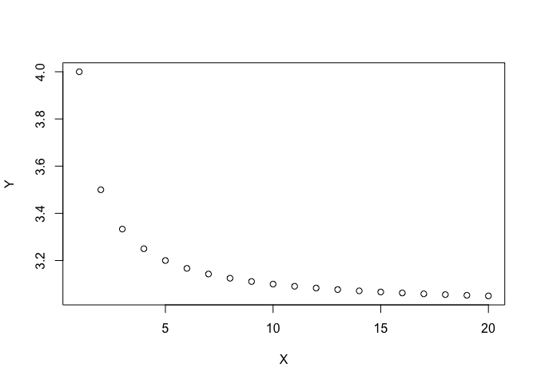
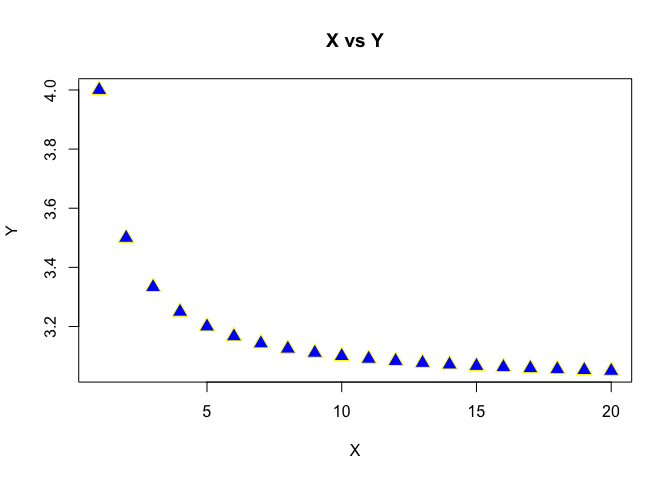
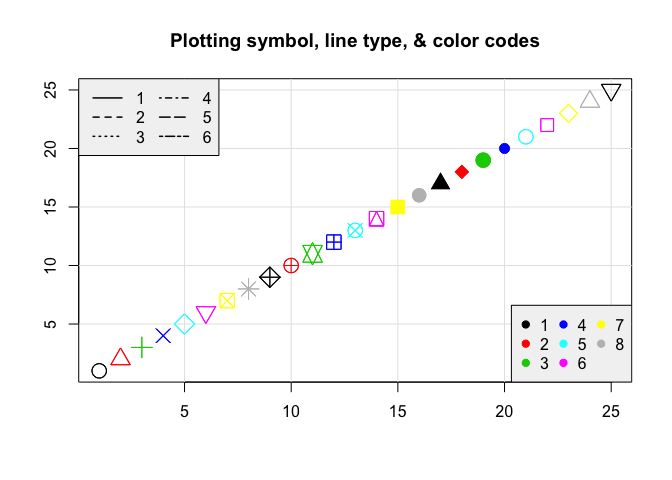
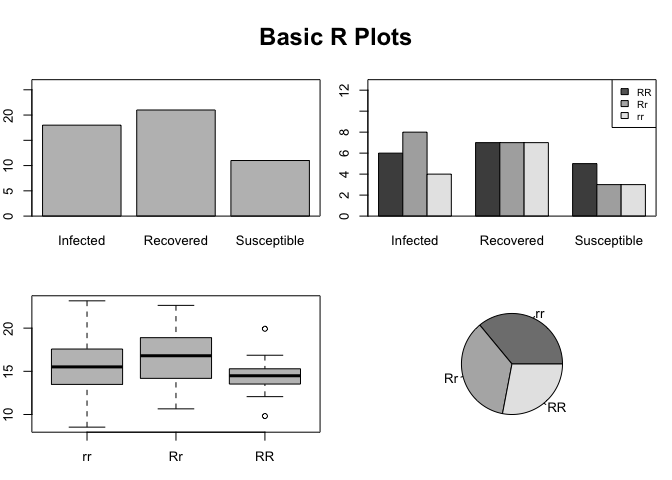
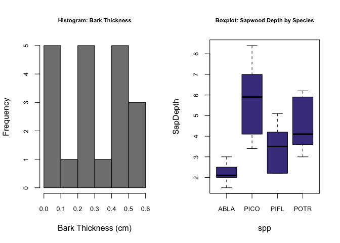
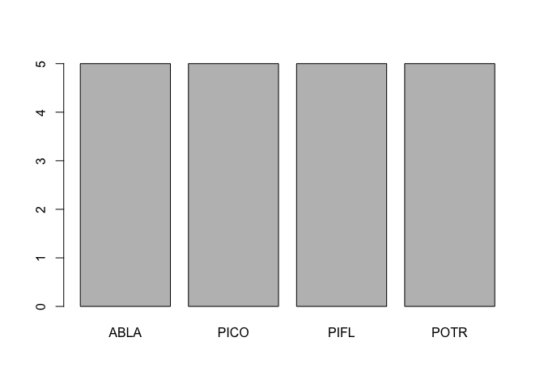
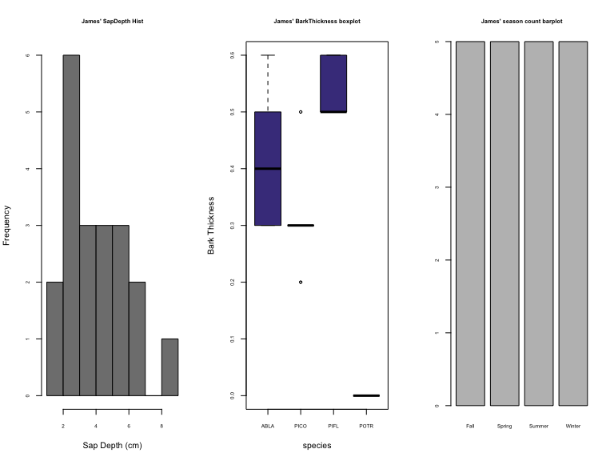

Welcome to Advanced R
================

## Welcome Back\!

Welcome to the Advanced phase of R. In this class, we’ll be covering new
topics at an accelerated pace. But first, let’s shake off the rust and
get back into the swing of things. As always, if you need revisit older
tutorials, they can be found here -
<https://github.com/jsimkins2/geog473-673/tree/master/R>

# Downloading Data from the datasets folder

All datasets used for this class will be found here -
<https://github.com/jsimkins2/geog473-673/tree/master/datasets/>

In order to download these files easily, you can use the following
code:

`download.file("https://github.com/jsimkins2/geog473-673/tree/master/datasets/world_shpfiles/world.shp",
destfile = "/Users/james/Downloads/world.shp" , mode='wb')`

Follow this format for any of the datasets. Here is another example for
the
`TreeData.csv`

`download.file("https://github.com/jsimkins2/geog473-673/tree/master/datasets/TreeData.csv",
destfile = "/Users/james/Downloads/TreeData.csv" ,
mode='wb')`

## Some Useful Definitions

| Function      | Description                                                                                                           |
| ------------- | --------------------------------------------------------------------------------------------------------------------- |
| ls            | lists contents of R workspace/global environment                                                                      |
| rm            | removes objects from R workspace                                                                                      |
| save          | save selected objects                                                                                                 |
| \+,-,\*,/,^   | arithmetic operators                                                                                                  |
| %\*%          | matrix multiplication                                                                                                 |
| t             | matrix transpose                                                                                                      |
| solve         | matrix inverse (and solving linear equations)                                                                         |
| c             | combines (concatenates) objects, simplest way to make vectors                                                         |
| seq           | creates vectors that are regular sequences                                                                            |
| rep           | replicates vectors                                                                                                    |
| length        | returns length of a vector                                                                                            |
| sum           | returns the sum                                                                                                       |
| mean          | returns the mean                                                                                                      |
| median        | returns the median                                                                                                    |
| sd            | returns the standard deviation (n − 1 in denominator)                                                                 |
| min           | returns minimum                                                                                                       |
| max           | returns maximum                                                                                                       |
| sort          | sort a vector (rearranges the vector in order)                                                                        |
| order         | returns indices of vectors that will order them                                                                       |
| rank          | returns rank of each element in vector                                                                                |
| \==, \<, \>   | comparison operators                                                                                                  |
| \<=, \>=, \!= |                                                                                                                       |
|               | , &                                                                                                                   |
| is.na         | tests for missing value NA                                                                                            |
| which         | does logical comparison and indicates which elements are TRUE that is, gives the TRUE indices of a logical object     |
| any           | does logical comparison returns 1 (TRUE) if any of the comparisons are TRUE, i.e. is at least one of the values true? |
| exp           | returns e to that power                                                                                               |
| log           | returns natural logarithm (to the base e)                                                                             |
| log10         | returns logarithm (to the base 10)                                                                                    |
| sqrt          | returns square root                                                                                                   |
| table         | does frequencies and cross-tabs                                                                                       |
| help          | help page on specified function                                                                                       |
| cbind         | combine by columns                                                                                                    |
| rbind         | combine by rows                                                                                                       |
| matrix        | create a matrix                                                                                                       |
| vector        | create a vector                                                                                                       |
| nrow          | number of rows in an array or data frame                                                                              |
| ncol          | number of columns in an array or data frame                                                                           |
| dim           | dimensions of an array or data frame                                                                                  |
| array         | create an array                                                                                                       |

| Function      | Description                                                       |
| ------------- | ----------------------------------------------------------------- |
| is.vector     | answers the question, is this a vector TRUE or FALSE              |
| as.vector     | attempts to coerce object into a vector                           |
| read.table    | reads data from a text file                                       |
| read.csv      | reads data from a text file with comma separated data             |
| write.table   | writes a data frame to a text file                                |
| is.data.frame | tests object to see if it is data frame                           |
| as.data.frame | coerces object into data frame                                    |
| is.factor     | tests object to see if it is a factor                             |
| as.factor     | coerces object into a factor                                      |
| head, tail    | list the first, last six rows                                     |
| names         | returns names of elements of object                               |
| colnames      | returns or sets column names of object                            |
| rownames      | returns or sets row names of object                               |
| subset        | select part of a vector, matrix, or data frame                    |
| merge         | merge two data frames                                             |
| lm            | multiple linear regression                                        |
| glm           | generalized linear regression                                     |
| anova         | analysis of variance                                              |
| chisq.test    | Pearson’s Chi-squared test for count data                         |
| summary       | shows results of various model fitting functions                  |
| predict       | predicted results from model                                      |
| hist          | histogram                                                         |
| boxplot       | box plot                                                          |
| plot          | scatterplot                                                       |
| lines         | connects points sequentially with lines (added to a plot)         |
| segments      | add lines to a plot (between pairs of points)                     |
| text          | add text to a plot                                                |
| legend        | add a legend to a plot                                            |
| abline        | add a line to a plot by specifying its slope and intercept        |
| passing       | an lm object will result in adding the predicted line to the plot |
| x11           | open another graphics window (PC)                                 |
| pdf           | open a pdf file for recording graphics                            |
| dev.off       | close graphics device                                             |
| par(mfrow)    | arranges multiple plots on same page (by row)                     |
| sample        | produces a random sample of the specified values                  |
| set.seed      | sets seed for next random sample (repeat random sample)           |
| rnorm         | produces a random sample from a normal distribution               |
| qnorm         | quantiles (percentiles) of normal distribution                    |
| pnorm         | CDF of normal distribution                                        |
| dnorm         | PDF of normal distribution                                        |
| rbinom        | produces a random sample from a binomial distribution             |

## Let’s do some basic recap

Variable Assignment & Operations

``` r
x = 7
y = 9
z <- y * (x/2 + 7) + sqrt(y)

print(x)
```

    ## [1] 7

``` r
y
```

    ## [1] 9

``` r
z
```

    ## [1] 97.5

``` r
X <- 1:20
Y <- (1 + 1/X) + 2
X
```

    ##  [1]  1  2  3  4  5  6  7  8  9 10 11 12 13 14 15 16 17 18 19 20

``` r
Y
```

    ##  [1] 4.000000 3.500000 3.333333 3.250000 3.200000 3.166667 3.142857 3.125000
    ##  [9] 3.111111 3.100000 3.090909 3.083333 3.076923 3.071429 3.066667 3.062500
    ## [17] 3.058824 3.055556 3.052632 3.050000

``` r
plot(X,Y)
```

<!-- -->

Now let’s add in some extra arguments to the plot function to make it
prettier

``` r
plot(x=X,y=Y, type = "p", pch=c(24), col = 'yellow', bg='blue', cex = 1.6, xlab = "X", ylab = "Y")
title("X vs Y")
```

<!-- -->

Having trouble remembering the arguments that the function `plot()`
accepts? Same…so just run `?plot` for RStudio’s built in helper.

Recap:

  - type == type of plot - p stands for points
  - pch == plotting ‘character’, i.e., symbol to use
  - col == color
  - bg == background color (only applicable for pch’s between 21:25)
  - cex == size of the points
  - xlab == x label
  - ylab == y label

## In Class Exercise:

Create a plot above using a sequence of X values where Y is the log of
the X values. Use both lines and points, pch of 21, cex of 1.5, and
colors of your choosing.

## More Plotting

Let’s take a look at the different kind of points and arguments that go
into a plotting function call

``` r
plot(1:25, 1:25, xlab="",ylab="",pch=1:25,col=1:25,cex=2)
grid(lty=1, col="gray90")
points(1:25, 1:25, xlab="",ylab="",pch=1:25,col=1:25,cex=2)
title("Plotting symbol, line type, & color codes")
legend("topleft", legend=1:6, lty=1:6, lwd=1.5, ncol=2, bg="gray95")
legend("bottomright", legend=1:8, col=1:8, ncol=3, pch=19, bg="gray95")
```

<!-- -->

## Basic types of plots with dummy data

We’re going to create a fake dataset of those who are infected by the
coronavirus. Let’s do so using the `sample()`
function.

``` r
# Create a random sample of the 3 types - Susceptible, Infected and Recovered
InfStatus <- factor(sample(c("Susceptible", "Infected", "Recovered"),size = 50, replace = TRUE))
I <- table(InfStatus)
I
```

    ## InfStatus
    ##    Infected   Recovered Susceptible 
    ##          18          21          11

``` r
# Now let's make a random sample of 3 genotypes (RR, Rr, and rr)
Genotype <- factor(sample(c("RR", "Rr", "rr"), size = 50, replace = TRUE))
G <- table(Genotype)
G
```

    ## Genotype
    ## rr Rr RR 
    ## 18 18 14

``` r
#show genotype and infected status as a table 
table(Genotype, InfStatus)
```

    ##         InfStatus
    ## Genotype Infected Recovered Susceptible
    ##       rr        6         7           5
    ##       Rr        8         7           3
    ##       RR        4         7           3

Note - We turned the sample data info a `factor` to make sure the
factors aren’t double indexed…here is what I mean…

``` r
# WITHOUT the factor
test <- sample(c("Susceptible", "Infected", "Recovered"),size = 50, replace = TRUE)
test
```

    ##  [1] "Recovered"   "Susceptible" "Infected"    "Infected"    "Recovered"  
    ##  [6] "Infected"    "Infected"    "Susceptible" "Recovered"   "Infected"   
    ## [11] "Susceptible" "Recovered"   "Susceptible" "Infected"    "Infected"   
    ## [16] "Infected"    "Infected"    "Susceptible" "Susceptible" "Recovered"  
    ## [21] "Infected"    "Infected"    "Infected"    "Recovered"   "Recovered"  
    ## [26] "Infected"    "Susceptible" "Infected"    "Infected"    "Infected"   
    ## [31] "Susceptible" "Infected"    "Susceptible" "Susceptible" "Infected"   
    ## [36] "Recovered"   "Susceptible" "Susceptible" "Recovered"   "Infected"   
    ## [41] "Infected"    "Infected"    "Susceptible" "Recovered"   "Susceptible"
    ## [46] "Recovered"   "Infected"    "Susceptible" "Infected"    "Infected"

``` r
class(test)
```

    ## [1] "character"

``` r
# Now as a factor
test2 <- factor(sample(c("Susceptible", "Infected", "Recovered"),size = 50, replace = TRUE))
test2
```

    ##  [1] Infected    Recovered   Recovered   Susceptible Recovered   Recovered  
    ##  [7] Recovered   Susceptible Recovered   Infected    Susceptible Infected   
    ## [13] Susceptible Susceptible Susceptible Susceptible Susceptible Susceptible
    ## [19] Infected    Susceptible Recovered   Susceptible Susceptible Infected   
    ## [25] Infected    Susceptible Recovered   Recovered   Recovered   Recovered  
    ## [31] Infected    Infected    Susceptible Infected    Susceptible Infected   
    ## [37] Recovered   Susceptible Recovered   Recovered   Infected    Susceptible
    ## [43] Infected    Infected    Recovered   Susceptible Infected    Recovered  
    ## [49] Susceptible Infected   
    ## Levels: Infected Recovered Susceptible

``` r
class(test2)
```

    ## [1] "factor"

## Now let’s plot this fake data

``` r
par(mfrow=c(2, 2), mar=c(3, 2, 2, 1), oma=c(0, 0, 3, 0), bg = "white") ## create plot array of 2 row x 2 columns
plot(InfStatus, ylim = c(0, 27)) # basic plot with y limit set as a range
box() # just adds a box around the plot above
barplot(table(Genotype, InfStatus), ylim = c(0, 13), beside = TRUE) # barplot
box() # adds a box around the plot above
legend("topright", c("RR", "Rr", "rr"), fill = c("gray40", "gray70", "gray90"), ncol = 1, cex = 0.75) # legend
boxplot(rnorm(50, mean = 15, sd = 3) ~ Genotype, col = "gray75") # boxplot
pie(G, col = c("gray50", "gray70", "gray90")) # pie plot
mtext("Basic R Plots", outer = TRUE, cex = 1.5, font = 2) # main title
```

<!-- -->

# Playing with Tree Data

Let’s say you’re an ecologist who collected some tree data samples out
in the field. Let’s load this into R and explore the data. In order to
proceed, you’ll need to download **TreeData.csv** which is located here
-
(<https://github.com/jsimkins2/geog473-673/tree/master/datasets/TreeData.csv>)

``` r
# Navigate to the location where your file is stored locally. Use read.csv() function to load the data
treedat <- read.csv("/Users/james/Documents/Github/geog473-673/datasets/TreeData.csv")
treedat
```

    ##    tree  spp season Infected  dbh SapDepth BarkThick NobarkArea Heartwood
    ## 1     1 PICO Summer      Yes 42.2      8.4       0.3     1359.2     483.1
    ## 2     2 ABLA   Fall      Yes 13.4      2.0       0.4      124.7      58.1
    ## 3     3 ABLA Summer       No 13.1      1.5       0.3      122.7      70.9
    ## 4     4 PICO Spring       No 15.0      4.1       0.2      167.4      32.2
    ## 5     5 POTR Winter      Yes 14.2      3.6       0.0      158.4      38.5
    ## 6     6 POTR Winter      Yes 20.0      5.9       0.0      314.2      52.8
    ## 7     7 ABLA Summer      Yes  9.1      2.1       0.3       56.7      14.5
    ## 8     8 ABLA Spring       No  9.2      2.5       0.5       52.8       8.0
    ## 9     9 ABLA   Fall      Yes 27.3      3.0       0.6      535.0     317.3
    ## 10   10 PICO   Fall       No 11.2      3.4       0.3       88.2      11.3
    ## 11   11 PICO Spring      Yes 18.0      5.9       0.3      237.8      24.6
    ## 12   12 POTR Summer       No  9.0      3.0       0.0       63.6       7.1
    ## 13   13 POTR Spring       No 15.4      4.1       0.0      186.3      40.7
    ## 14   14 POTR Winter       No 24.1      6.2       0.0      456.2     107.5
    ## 15   15 PICO Winter      Yes 24.2      7.0       0.5      422.7      66.5
    ## 16   16 PIFL   Fall       No 14.4      4.2       0.5      141.0      19.6
    ## 17   17 PIFL Winter       No 13.1      2.2       0.6      111.2      44.2
    ## 18   18 PIFL Summer      Yes 21.5      5.1       0.6      323.7      80.1
    ## 19   19 PIFL Spring       No 13.4      2.2       0.5      120.8      50.3
    ## 20   20 PIFL   Fall      Yes 16.2      3.5       0.5      181.5      52.8
    ##    SapArea
    ## 1    876.1
    ## 2     66.6
    ## 3     51.8
    ## 4    135.2
    ## 5    119.9
    ## 6    261.3
    ## 7     42.2
    ## 8     44.8
    ## 9    217.7
    ## 10    76.9
    ## 11   213.2
    ## 12    56.5
    ## 13   145.5
    ## 14   348.7
    ## 15   356.3
    ## 16   121.4
    ## 17    67.0
    ## 18   243.5
    ## 19    70.5
    ## 20   128.6

`treedat` is a data frame. As a reminder, a data frame is essentially a
2-dimensional array that contains a *combination* of vectors (columns of
data) that are of the class; integer, numeric, character. This is
*different* from a matrix which can only contain *1 type* of data. In
this case, we have some tree data that includes species of tree, season
the data was collected, diameter of the tree, bark thickness, area of no
bark, heartwood diameter, and sapwood diameter.


Now, let’s edit htis dataframe to the format we want it in. Then, let’s
plot a histogram of bark thickness and a boxplot of sapdepth by species.

``` r
# let's set the rownames equal to the tree column
treedat <- read.csv("/Users/james/Documents/Github/geog473-673/datasets/TreeData.csv",row.names='tree')
# print treedat
treedat
```

    ##     spp season Infected  dbh SapDepth BarkThick NobarkArea Heartwood SapArea
    ## 1  PICO Summer      Yes 42.2      8.4       0.3     1359.2     483.1   876.1
    ## 2  ABLA   Fall      Yes 13.4      2.0       0.4      124.7      58.1    66.6
    ## 3  ABLA Summer       No 13.1      1.5       0.3      122.7      70.9    51.8
    ## 4  PICO Spring       No 15.0      4.1       0.2      167.4      32.2   135.2
    ## 5  POTR Winter      Yes 14.2      3.6       0.0      158.4      38.5   119.9
    ## 6  POTR Winter      Yes 20.0      5.9       0.0      314.2      52.8   261.3
    ## 7  ABLA Summer      Yes  9.1      2.1       0.3       56.7      14.5    42.2
    ## 8  ABLA Spring       No  9.2      2.5       0.5       52.8       8.0    44.8
    ## 9  ABLA   Fall      Yes 27.3      3.0       0.6      535.0     317.3   217.7
    ## 10 PICO   Fall       No 11.2      3.4       0.3       88.2      11.3    76.9
    ## 11 PICO Spring      Yes 18.0      5.9       0.3      237.8      24.6   213.2
    ## 12 POTR Summer       No  9.0      3.0       0.0       63.6       7.1    56.5
    ## 13 POTR Spring       No 15.4      4.1       0.0      186.3      40.7   145.5
    ## 14 POTR Winter       No 24.1      6.2       0.0      456.2     107.5   348.7
    ## 15 PICO Winter      Yes 24.2      7.0       0.5      422.7      66.5   356.3
    ## 16 PIFL   Fall       No 14.4      4.2       0.5      141.0      19.6   121.4
    ## 17 PIFL Winter       No 13.1      2.2       0.6      111.2      44.2    67.0
    ## 18 PIFL Summer      Yes 21.5      5.1       0.6      323.7      80.1   243.5
    ## 19 PIFL Spring       No 13.4      2.2       0.5      120.8      50.3    70.5
    ## 20 PIFL   Fall      Yes 16.2      3.5       0.5      181.5      52.8   128.6

``` r
# look at the data frame variable names 
names(treedat)
```

    ## [1] "spp"        "season"     "Infected"   "dbh"        "SapDepth"  
    ## [6] "BarkThick"  "NobarkArea" "Heartwood"  "SapArea"

``` r
# print the dbh variable
treedat$dbh
```

    ##  [1] 42.2 13.4 13.1 15.0 14.2 20.0  9.1  9.2 27.3 11.2 18.0  9.0 15.4 24.1 24.2
    ## [16] 14.4 13.1 21.5 13.4 16.2

``` r
# rename the dbh variable, but first let's be sure our index of the dbh variable is correct
colnames(treedat)[4]
```

    ## [1] "dbh"

``` r
# yep, dbh is the index number 4 
colnames(treedat)[4] = "tree.diameter"
treedat
```

    ##     spp season Infected tree.diameter SapDepth BarkThick NobarkArea Heartwood
    ## 1  PICO Summer      Yes          42.2      8.4       0.3     1359.2     483.1
    ## 2  ABLA   Fall      Yes          13.4      2.0       0.4      124.7      58.1
    ## 3  ABLA Summer       No          13.1      1.5       0.3      122.7      70.9
    ## 4  PICO Spring       No          15.0      4.1       0.2      167.4      32.2
    ## 5  POTR Winter      Yes          14.2      3.6       0.0      158.4      38.5
    ## 6  POTR Winter      Yes          20.0      5.9       0.0      314.2      52.8
    ## 7  ABLA Summer      Yes           9.1      2.1       0.3       56.7      14.5
    ## 8  ABLA Spring       No           9.2      2.5       0.5       52.8       8.0
    ## 9  ABLA   Fall      Yes          27.3      3.0       0.6      535.0     317.3
    ## 10 PICO   Fall       No          11.2      3.4       0.3       88.2      11.3
    ## 11 PICO Spring      Yes          18.0      5.9       0.3      237.8      24.6
    ## 12 POTR Summer       No           9.0      3.0       0.0       63.6       7.1
    ## 13 POTR Spring       No          15.4      4.1       0.0      186.3      40.7
    ## 14 POTR Winter       No          24.1      6.2       0.0      456.2     107.5
    ## 15 PICO Winter      Yes          24.2      7.0       0.5      422.7      66.5
    ## 16 PIFL   Fall       No          14.4      4.2       0.5      141.0      19.6
    ## 17 PIFL Winter       No          13.1      2.2       0.6      111.2      44.2
    ## 18 PIFL Summer      Yes          21.5      5.1       0.6      323.7      80.1
    ## 19 PIFL Spring       No          13.4      2.2       0.5      120.8      50.3
    ## 20 PIFL   Fall      Yes          16.2      3.5       0.5      181.5      52.8
    ##    SapArea
    ## 1    876.1
    ## 2     66.6
    ## 3     51.8
    ## 4    135.2
    ## 5    119.9
    ## 6    261.3
    ## 7     42.2
    ## 8     44.8
    ## 9    217.7
    ## 10    76.9
    ## 11   213.2
    ## 12    56.5
    ## 13   145.5
    ## 14   348.7
    ## 15   356.3
    ## 16   121.4
    ## 17    67.0
    ## 18   243.5
    ## 19    70.5
    ## 20   128.6

``` r
# Now let's do some plotting 
par(mfrow=c(1,2)) ## create plot array of 1 row x 2 columns
par(cex.axis=0.8) ## shrinks the name size of the x axes. If we don't do this, not all the names in the boxplot show up
par(cex.main=0.7) ## shrinks the name size of the titles. If we don't do this, the titles don't fit in the window
# Use the his() function to plot a histogram 
hist(treedat$BarkThick, xlab= "Bark Thickness (cm)", main= "Histogram: Bark Thickness", col= "gray50")
boxplot(SapDepth ~ spp, data= treedat, ylab= "SapDepth", col= "darkslateblue", main= "Boxplot: Sapwood Depth by Species")
```

<!-- -->

Note: hist() is the histogram function and boxplot() is the boxplot
function. For the boxplot, notice how the x ~ y, data=dataframe syntax
is. It’s slightly different than the plotting instances above and for
the histogram. For a histogram, the hist() function can only intake
numerical values. Thus, if we wanted to take a species histogram, we
would have to take a workaround like so -

``` r
barplot(summary(treedat$spp))
```

<!-- -->

## Assignment:

Using the TreeData.csv above, complete the following:

1.  Rename ‘spp’ variable to ‘species’
2.  Make a 3 column plot consisting of Sapwood Depth histogram, boxplot
    of Bark Thickness by species, and a histogram showing the seasonal
    counts.
3.  Submit plot to Assignment 1 on Canvas

Your final plot should look like this

<!-- -->
