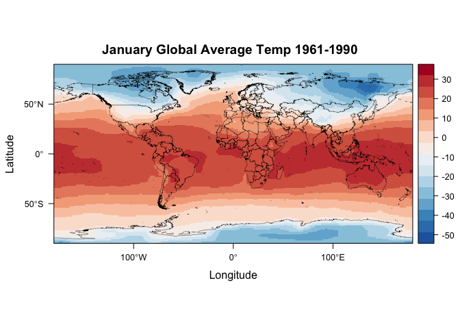
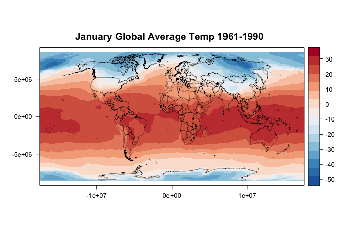

Reprojecting & Writing Rasters
================

Recapping Skills: Indexing Data
-------------------------------

``` r
matA=matrix(1:16,4,4)
matA
```

    ##      [,1] [,2] [,3] [,4]
    ## [1,]    1    5    9   13
    ## [2,]    2    6   10   14
    ## [3,]    3    7   11   15
    ## [4,]    4    8   12   16

``` r
matA[2,3]
```

    ## [1] 10

``` r
matA[c(1,3),c(2,4)]
```

    ##      [,1] [,2]
    ## [1,]    5   13
    ## [2,]    7   15

``` r
matA[1:3,2:4]
```

    ##      [,1] [,2] [,3]
    ## [1,]    5    9   13
    ## [2,]    6   10   14
    ## [3,]    7   11   15

``` r
matA[1:2,]
```

    ##      [,1] [,2] [,3] [,4]
    ## [1,]    1    5    9   13
    ## [2,]    2    6   10   14

``` r
matA[,1:2]
```

    ##      [,1] [,2]
    ## [1,]    1    5
    ## [2,]    2    6
    ## [3,]    3    7
    ## [4,]    4    8

``` r
matA[1,]
```

    ## [1]  1  5  9 13

``` r
dim(matA)
```

    ## [1] 4 4

In Class Exercise:
------------------

Starting with this code...

``` r
matA=matrix(1:16,4,4)
```

Make this matrix....

    ##      [,1] [,2] [,3] [,4]
    ## [1,]    1   10   18   26
    ## [2,]   47   47   47   47
    ## [3,]    6   14   22   39
    ## [4,]    8   16   24   32

Resampling and Reprojecting data in R
-------------------------------------

``` r
# load in the packages
library(raster)
library(rasterVis)
library(maptools) # also loads sp package

# load in dataset directly via raster package, specify varname which is 'tem' for 'temperature' 
temClim = raster("~/Downloads/globalTemClim1961-1990.nc", varname = 'tem', band=1)
temClim
```

    ## class       : RasterLayer 
    ## band        : 1  (of  12  bands)
    ## dimensions  : 36, 72, 2592  (nrow, ncol, ncell)
    ## resolution  : 5, 5  (x, y)
    ## extent      : -180, 180, -90, 90  (xmin, xmax, ymin, ymax)
    ## coord. ref. : +proj=longlat +datum=WGS84 +ellps=WGS84 +towgs84=0,0,0 
    ## data source : /Users/james/Downloads/globalTemClim1961-1990.nc 
    ## names       : CRU_Global_1961.1990_Mean_Monthly_Surface_Temperature_Climatology 
    ## z-value     : 1 
    ## zvar        : tem

``` r
# Create a new, blank raster that has a totally different sizing
newRaster = raster()
newRaster
```

    ## class       : RasterLayer 
    ## dimensions  : 180, 360, 64800  (nrow, ncol, ncell)
    ## resolution  : 1, 1  (x, y)
    ## extent      : -180, 180, -90, 90  (xmin, xmax, ymin, ymax)
    ## coord. ref. : +proj=longlat +datum=WGS84 +ellps=WGS84 +towgs84=0,0,0

``` r
#resample the temClim raster to the resizedRaster
resTemClim = resample(x=temClim, y=newRaster, method='bilinear')
resTemClim
```

    ## class       : RasterLayer 
    ## dimensions  : 180, 360, 64800  (nrow, ncol, ncell)
    ## resolution  : 1, 1  (x, y)
    ## extent      : -180, 180, -90, 90  (xmin, xmax, ymin, ymax)
    ## coord. ref. : +proj=longlat +datum=WGS84 +ellps=WGS84 +towgs84=0,0,0 
    ## data source : in memory
    ## names       : CRU_Global_1961.1990_Mean_Monthly_Surface_Temperature_Climatology 
    ## values      : -48.8, 32  (min, max)

``` r
#define new projection as robinson via a proj4 string. Note that this can also be achieved
# using EPSG codes with the following - "+init=epsg:4326" for longlat
newproj <- CRS("+proj=robin +lon_0=0 +x_0=0 +y_0=0 +ellps=WGS84 +datum=WGS84 +units=m +no_defs" )
newproj
```

    ## CRS arguments:
    ##  +proj=robin +lon_0=0 +x_0=0 +y_0=0 +ellps=WGS84 +datum=WGS84
    ## +units=m +no_defs +towgs84=0,0,0

``` r
# reproject the raster to the new projection
projTemClim = projectRaster(resTemClim,crs=newproj)
projTemClim
```

    ## class       : RasterLayer 
    ## dimensions  : 171, 372, 63612  (nrow, ncol, ncell)
    ## resolution  : 94500, 107000  (x, y)
    ## extent      : -17570274, 17583726, -9136845, 9160155  (xmin, xmax, ymin, ymax)
    ## coord. ref. : +proj=robin +lon_0=0 +x_0=0 +y_0=0 +ellps=WGS84 +datum=WGS84 +units=m +no_defs +towgs84=0,0,0 
    ## data source : in memory
    ## names       : CRU_Global_1961.1990_Mean_Monthly_Surface_Temperature_Climatology 
    ## values      : -48.15073, 31.77627  (min, max)

``` r
data(wrld_simpl)
plt <- levelplot(resTemClim, margin=F, par.settings=BuRdTheme,
                 main="January Global Average Temp 1961-1990")
plt + layer(sp.lines(wrld_simpl, col='black', lwd=0.4))
```



``` r
# convert the wrld_simpl land polygons to the robinson projection
wrld_simpl = spTransform(wrld_simpl, CRS("+proj=robin +lon_0=0 +x_0=0 +y_0=0 +ellps=WGS84 +datum=WGS84 +units=m +no_defs" ))

plt <- levelplot(projTemClim, margin=F, par.settings=BuRdTheme,
                 main="January Global Average Temp 1961-1990")
plt + layer(sp.lines(wrld_simpl, col='black', lwd=0.4))
```



Example of how to save directly to PNG
--------------------------------------

The png() function is a function that saves a plot to png. After we invoke the function and fill out the arguments, we need to execute the plot code between the png() function and dev.off(). dev.off() tells R that you're done adding things to the plot and that it can be done plotting.

``` r
png(filename = "~/Downloads/myPNG.png", width = 10, height = 6, units = 'in',res=100)
plt <- levelplot(projTemClim, margin=F, par.settings=BuRdTheme,
                 main="January Global Average Temp 1961-1990")
plt + layer(sp.lines(wrld_simpl, col='black', lwd=0.4))
dev.off()
```

Example of how to write a raster out to geotiff or netcdf
---------------------------------------------------------

``` r
writeRaster(x=projTemClim, filename="~/Downloads/projectedTemClim1961-1990.tif", format='GTiff',
            varname="Temperature", longname="Global Average Temperature January 1960-1990",
            xname="lon", yname="lat")
```

In Class Assignment
-------------------

1.  Load in globalTemClim1961-1990.nc
2.  Extract data for January and July
3.  Find difference between two months globally
4.  Enhance resolution 2x using nearest neighbor method
5.  Plot in mollwide projection
6.  Write raster to NetCDF
7.  Upload PNG and netCDF file to Canvas under week 5 assignment
